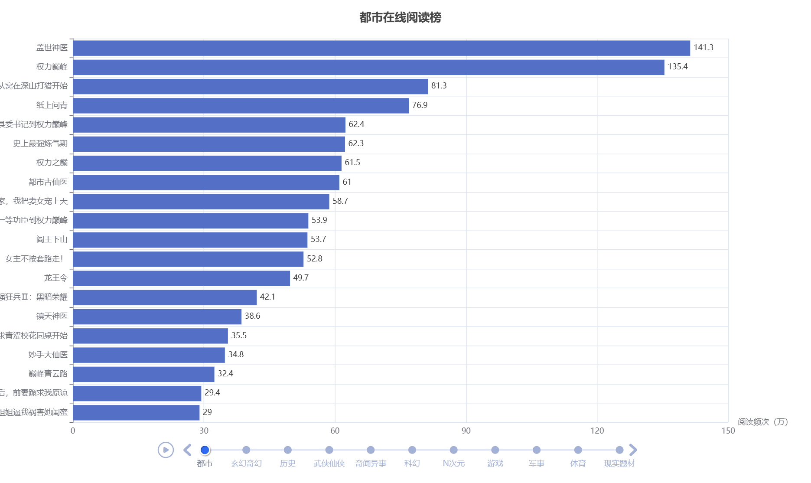
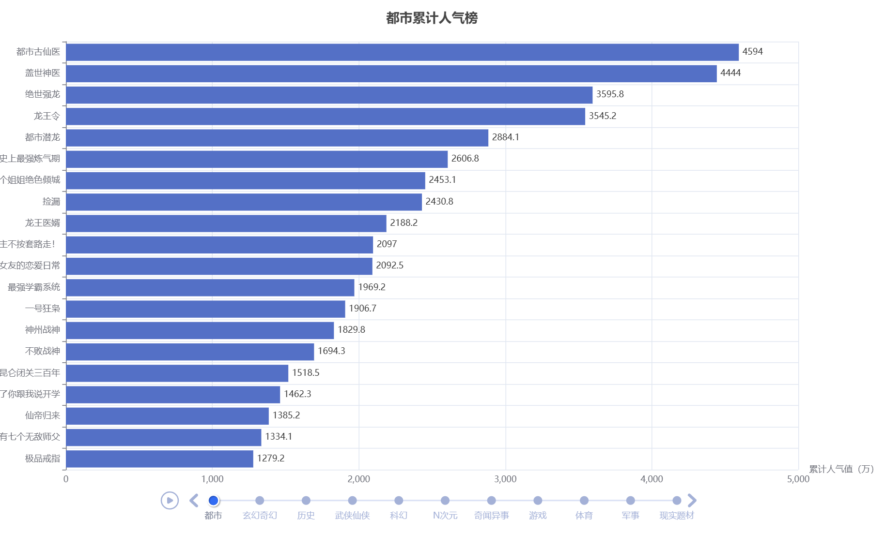
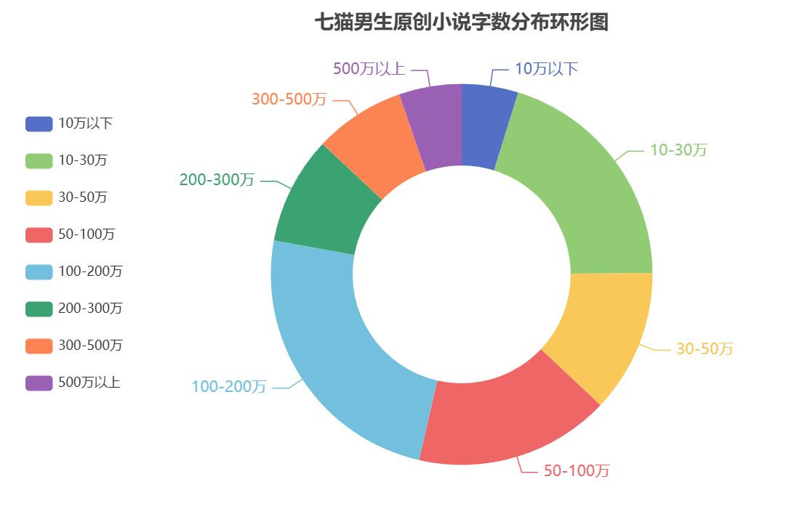
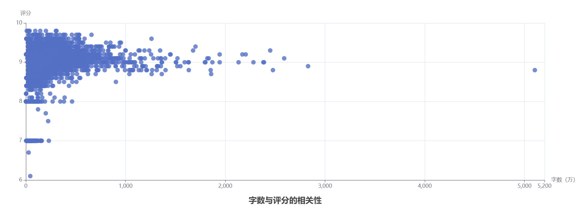
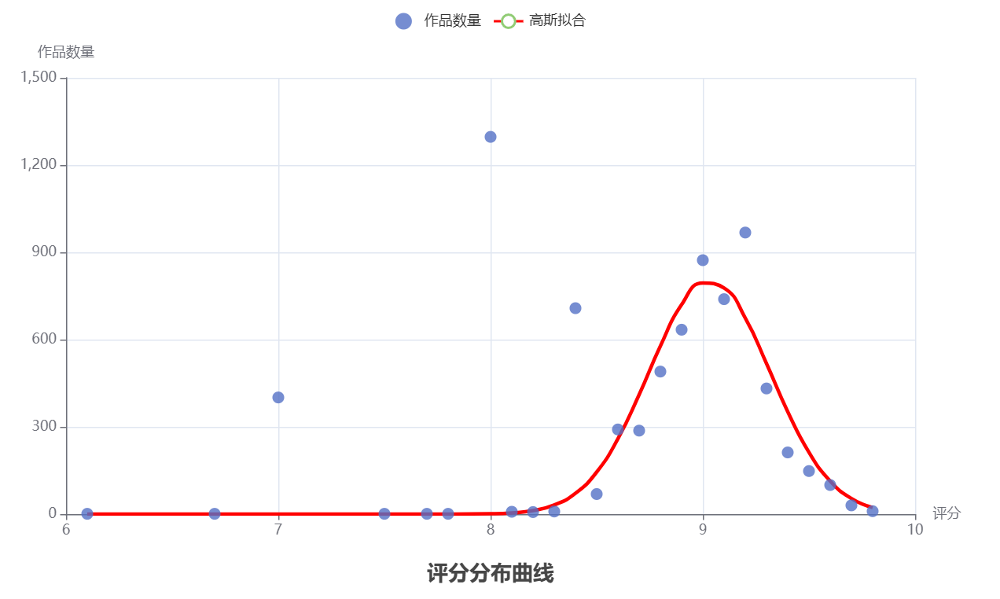
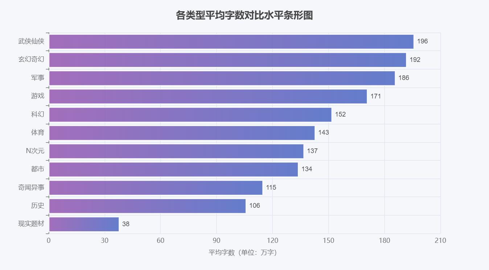
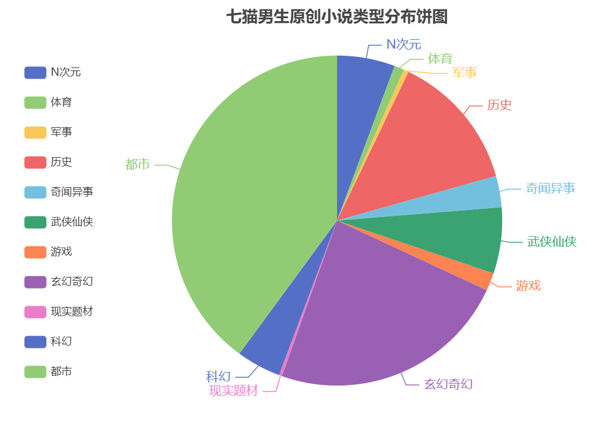

# 🚀 七猫小说网男生小说数据分析大揭秘
    
## 🌟 项目概览

---

**目标网站**：七猫中文网男生小说专区  
**数据规模**：男生小说共7718本  
**分析维度**：12+核心指标深度挖掘  
**技术亮点**：Scrapy爬取 × 多维度分析 × 数据可视化

## 🎯 分析目标矩阵

---

| 维度   | 分析指标         | 可视化方案         |
|------|--------------|---------------|
| 基础分布 | 字数区间占比、类型占比  | 环形图+饼图        |
| 对比分析 | 类型平均字数条形图    | 横向对比柱状图       |
| 质量评估 | 评分正态分布曲线     | 散点图+高斯分布      |
| 标签生态 | 高频标签组合       | 动态词云图         |
| 关联分析 | 字数-评分相关性     | 动态散点图         |
| 榜单经济 | 双榜Top20作品    | 水球图+左右横向对比柱状图 |
| 类型榜单 | 双榜各类型Top20作品 | 自动横向轮播柱状图     |
| 作者价值 | Top20高产作者    | 立体柱状图         |

## 💡项目十二大亮点

---

### 🕸️ 智能爬虫系统

### 📊 多维分析体系
✅ **基础维度**：字数/类型/标签分布  
✅ **质量维度**：评分正态化建模  
✅ **商业维度**：人气/阅读双榜博弈  
✅ **创作维度**：作者生产力评估模型  

### 🛠️ 技术全景图
**爬虫引擎**  
  
**数据存储**  
  
**分析引擎**  

  
**可视化**  
  

### ⏳ 效能突破日志
| 阶段   | 关键技术       | 耗时  | 突破点       |
|------|------------|-----|-----------|
| 爬虫开发 | XPath动态解析  | 10h | 网页数据不一致   |
| 数据清洗 | Pandas提取清洗 | 3h  | 无效数据发现与处理 |
| 可视化  | 画面整体处理     | 10h | 动态交互实现    |

### 💡 核心发现

---

**总榜单**

[七猫人气and阅读Top20](https://themilkyway01.github.io/qimao-novels-analysis/images/七猫人气and阅读Top20.html)

👑 总累计人气TOP3
1. 《一剑独尊》- 10058.2万
2. 《我有一剑》- 7377.8万
3. 《太荒吞天诀》- 5659.7万

📚 阅读量TOP3
1. 《太荒吞天诀》- 322.4万
2. 《剑来》- 203万
3. 《无敌天命》- 196.5万

- 总人气值和总阅读量的Top20作品有40%的重合。
- 不难发现人气榜全为老书，而阅读榜中有60%为新书。
- 老书依旧韵味十足，新书也迸发着强劲活力，这正是一个新老逐渐交替的时候。
- 

- 又从作者产出来看，产出最多的都是老作者，说明急需新作者的进入和沉淀。

**人气值和阅读量分布**

| 类别   | 表现特征      | 用户需求解读   |
|------|-----------|----------|
| 都市类  | 📈 双榜数据领跑 | 娱乐消遣为主   |
| 现实题材 | 📉 数据持续低位 | 严肃文学需求薄弱 |

**小说字数分布**

**字数与评分相关性散点图**

- 字数越多，评分并不一定越高，但字数越低评分可能会越低。
- 两者并没有强相关性

#### 高频标签组合

**标签组合TOP3:**  
🏆 东方玄幻 · 🥈 都市高武 · 🥉 都市高手

**运营建议:**  
📱 建立新书孵化计划：针对<50万作品设置创作激励  
🎥 IP联动开发池：筛选200万+优质长篇进行漫改/影视化  
🏅 设立「新类型探索奖」：鼓励都市+玄幻跨界创作（大胆推测）  

🔍 **特殊发现:**  

评分呈现`右偏分布`，主要集中在`8.0~9.0`之间 ➥ 疑似新书默认8.0分机制影响（猜测）

**其他图片**

---
